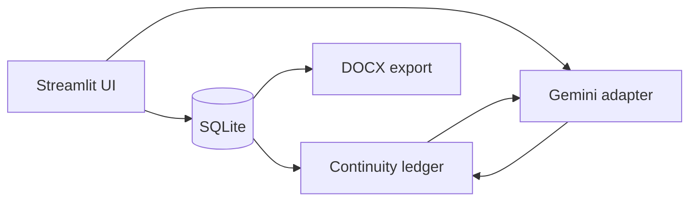

# Author Studio


A local-first Streamlit workspace for long-form fiction drafting with Gemini. It keeps a book bible, outline, chapters and continuity ledger in SQLite, then supplies only the context needed for drafting and editorial checks.

This started as a tool I built for my own fiction workflow. The interesting problem was not "ask an LLM to write a chapter"; it was keeping a 70k–100k word manuscript coherent while still allowing manual writing and revision.

## What it does

- Maintains multiple books in a local SQLite library.
- Stores concept, outline, chapters and per-chapter continuity summaries.
- Drafts a chapter from the current plan, prior chapter and continuity ledger.
- Extracts chapter plans from the outline without inventing missing beats.
- Supports manual writing and editing alongside AI drafting.
- Reassembles the manuscript and exports DOCX.
- Runs a continuity scan that proposes minimal exact-text fixes rather than rewriting whole scenes.
- Produces publishing-oriented positioning notes for genre, tropes, tone and keyword directions.
- Backs up and restores the local database.

## Design choices

**Local-first manuscript state.** The book itself lives in SQLite. Text is sent to Gemini only when the user explicitly runs an AI action.

**Continuity before brute-force context.** Each saved chapter gets a compact continuity ledger entry. Drafting uses that ledger plus the outline and the end of the previous chapter instead of blindly resending the entire manuscript every time.

**Human remains the editor.** Continuity fixes are proposals. A change is applied only when the exact source text still exists in the referenced chapter.

**AI failure should be visible.** Generation errors are shown to the user rather than silently replacing content or mutating the manuscript.

## Architecture



## Structure

```text
app.py                  Streamlit UI and workflow orchestration
author_studio/
  ai.py                 Gemini prompts and response parsing
  db.py                 SQLite persistence
  export.py             manuscript assembly and DOCX export
  text.py               pure text utilities
tests/                   small regression suite
```

## Run locally

```bash
python -m venv .venv
source .venv/bin/activate   # Windows: .venv\\Scripts\\activate
pip install -r requirements.txt
streamlit run app.py
```

You can paste a Gemini API key into the sidebar for a session, or create `.streamlit/secrets.toml`:

```toml
GEMINI_API_KEY = "your-key"
```

Local database files and Streamlit secrets are excluded by `.gitignore`.

## Tests

```bash
pytest -q
```

## Status

Personal prototype / portfolio project. It is intentionally small and local-first rather than a multi-user SaaS product.
